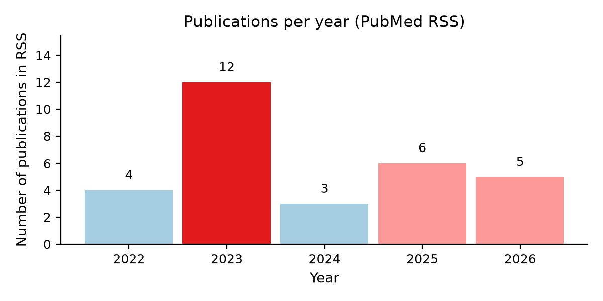
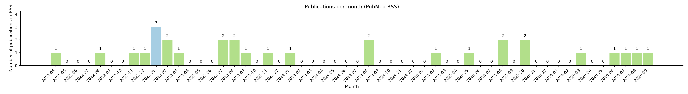
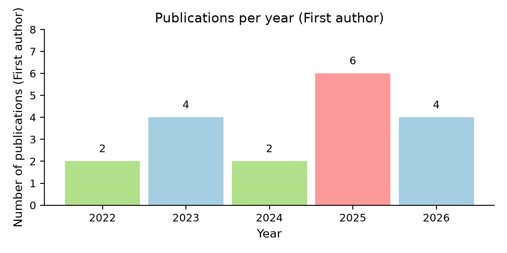
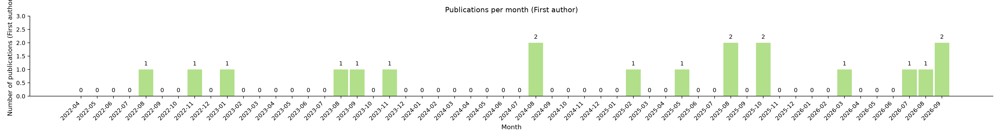

<h2 align="center">
  Xinsheng Wu · PhD Candidate from Fudan University
</h2>

  <a href="https://scholar.google.com/citations?hl=en&user=PoPkL4IAAAAJ"><b>Google Scholar</b></a> ·
  <a href="https://pubmed.ncbi.nlm.nih.gov/?term=Xinsheng+Wu+Huachun+Zou"><b>PubMed</b></a> ·
  <a href="https://xs-wu.github.io/"><b>Homepage</b></a>

  
  
  

### 🛠️ Tools & stacks

  
  
  
  
  
  

### 🛠️ Skills

  
  
  
  
  
  
  

### 📈 Publications per year

### 📊 Publications per month

### 📈 Publications per year (First author)

### 📊 Publications per month (First author)

## Recent publications

<!-- BLOG-POST-LIST:START -->
- **Xinsheng Wu**. **Real-World Evidence as a Complement to Randomized Trials in Interpreting Weight Gain on Modern INSTI Regimens**. *Clinical infectious diseases : an official publication of the Infectious Diseases Society of America*. 2025. [PubMed](https://pubmed.ncbi.nlm.nih.gov/41082587/?utm_source=Other&utm_medium=rss&utm_campaign=pubmed-2&utm_content=1TmjO1ifNewr3ZCXeKQ51L39DD88RQ2pLVl-AXtYCYAoQ3OQyZ&fc=20251114043805&ff=20260104140925&v=2.18.0.post22+67771e2)

- **Xinsheng Wu**. **Global, Regional, and National Burdens Attributable to Drug Use Across 204 Countries and Territories Between 1990 and 2021: The Global Burden of Disease Study 2021**. *Journal of addiction medicine*. 2025. [PubMed](https://pubmed.ncbi.nlm.nih.gov/41077644/?utm_source=Other&utm_medium=rss&utm_campaign=pubmed-2&utm_content=1TmjO1ifNewr3ZCXeKQ51L39DD88RQ2pLVl-AXtYCYAoQ3OQyZ&fc=20251114043805&ff=20260104140925&v=2.18.0.post22+67771e2)

- Lukun Zhang. **Impact of different INSTIs on BMI among people living with HIV who newly started ART in Shenzhen, China: a real-world data analysis**. *Clinical infectious diseases : an official publication of the Infectious Diseases Society of America*. 2025. [PubMed](https://pubmed.ncbi.nlm.nih.gov/40834233/?utm_source=Other&utm_medium=rss&utm_campaign=pubmed-2&utm_content=1TmjO1ifNewr3ZCXeKQ51L39DD88RQ2pLVl-AXtYCYAoQ3OQyZ&fc=20251114043805&ff=20260104140925&v=2.18.0.post22+67771e2)

- **Xinsheng Wu**. **Male Circumcision and HIV Risk Compensation Among Men Who Have Sex with Men: A Systematic Review and Meta-Analysis**. *AIDS and behavior*. 2025. [PubMed](https://pubmed.ncbi.nlm.nih.gov/40773103/?utm_source=Other&utm_medium=rss&utm_campaign=pubmed-2&utm_content=1TmjO1ifNewr3ZCXeKQ51L39DD88RQ2pLVl-AXtYCYAoQ3OQyZ&fc=20251114043805&ff=20260104140925&v=2.18.0.post22+67771e2)

- Weijie Zhang. **Efficacy of Voluntary Medical Male Circumcision to Prevent HIV Infection Among Men Who Have Sex With Men**. *Annals of internal medicine*. 2025. [PubMed](https://pubmed.ncbi.nlm.nih.gov/40388823/?utm_source=Other&utm_medium=rss&utm_campaign=pubmed-2&utm_content=1TmjO1ifNewr3ZCXeKQ51L39DD88RQ2pLVl-AXtYCYAoQ3OQyZ&fc=20251114043805&ff=20260104140925&v=2.18.0.post22+67771e2)

- **Xinsheng Wu**. **Substantial underdiagnosis and underreporting: changes in reported HIV and AIDS cases in 31 provinces in China at the beginning of COVID-19**. *Sexual health*. 2025. [PubMed](https://pubmed.ncbi.nlm.nih.gov/39946225/?utm_source=Other&utm_medium=rss&utm_campaign=pubmed-2&utm_content=1TmjO1ifNewr3ZCXeKQ51L39DD88RQ2pLVl-AXtYCYAoQ3OQyZ&fc=20251114043805&ff=20260104140925&v=2.18.0.post22+67771e2)

- **Xinsheng Wu**. **Prognostic prediction models for treatment experienced people living with HIV: a protocol for systematic review and meta-analysis**. *BMJ open*. 2024. [PubMed](https://pubmed.ncbi.nlm.nih.gov/39181549/?utm_source=Other&utm_medium=rss&utm_campaign=pubmed-2&utm_content=1TmjO1ifNewr3ZCXeKQ51L39DD88RQ2pLVl-AXtYCYAoQ3OQyZ&fc=20251114043805&ff=20260104140925&v=2.18.0.post22+67771e2)

- **Xinsheng Wu**. **Global, regional, and national burdens of HIV/AIDS acquired through sexual transmission 1990-2019: an observational study**. *Sexual health*. 2024. [PubMed](https://pubmed.ncbi.nlm.nih.gov/39146461/?utm_source=Other&utm_medium=rss&utm_campaign=pubmed-2&utm_content=1TmjO1ifNewr3ZCXeKQ51L39DD88RQ2pLVl-AXtYCYAoQ3OQyZ&fc=20251114043805&ff=20260104140925&v=2.18.0.post22+67771e2)

- Leiwen Fu. **Global, regional, and national burden of HIV and other sexually transmitted infections in older adults aged 60-89 years from 1990 to 2019: results from the Global Burden of Disease Study 2019**. *The lancet. Healthy longevity*. 2024. [PubMed](https://pubmed.ncbi.nlm.nih.gov/38183996/?utm_source=Other&utm_medium=rss&utm_campaign=pubmed-2&utm_content=1TmjO1ifNewr3ZCXeKQ51L39DD88RQ2pLVl-AXtYCYAoQ3OQyZ&fc=20251114043805&ff=20260104140925&v=2.18.0.post22+67771e2)

- **Xinsheng Wu**. **Longitudinal trajectories of weight changes among people living with HIV on antiretroviral therapy: A group-based study**. *iScience*. 2023. [PubMed](https://pubmed.ncbi.nlm.nih.gov/38026178/?utm_source=Other&utm_medium=rss&utm_campaign=pubmed-2&utm_content=1TmjO1ifNewr3ZCXeKQ51L39DD88RQ2pLVl-AXtYCYAoQ3OQyZ&fc=20251114043805&ff=20260104140925&v=2.18.0.post22+67771e2)
<!-- BLOG-POST-LIST:END -->

### GitHub overview

  
  

  

